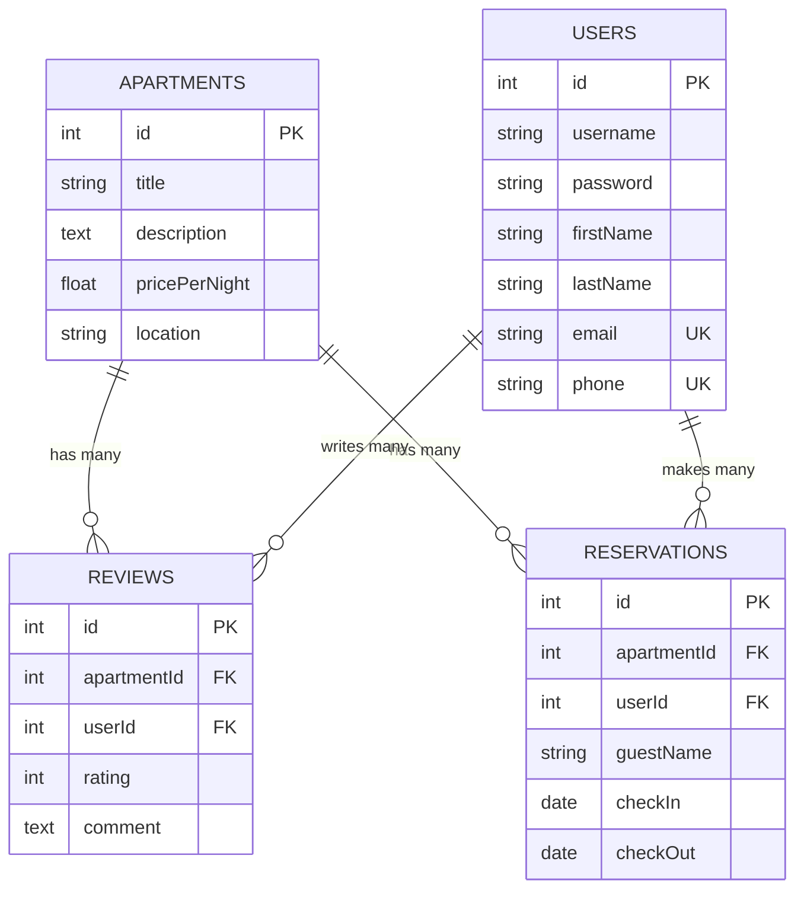

### 📊 Database Schema Diagram (ERD)

```mermaid
erDiagram
    APARTMENTS {
        int id PK
        string title
        text description
        float pricePerNight
        string location
    }
    USERS {
        int id PK
        string username
        string password
        string firstName
        string lastName
        string email UK
        string phone UK
    }
    REVIEWS {
        int id PK
        int apartmentId FK
        int userId FK
        int rating
        text comment
    }
    RESERVATIONS {
        int id PK
        int apartmentId FK
        int userId FK
        string guestName
        date checkIn
        date checkOut
    }

    APARTMENTS ||--o{ REVIEWS : "has many"
    APARTMENTS ||--o{ RESERVATIONS : "has many"
    USERS ||--o{ REVIEWS : "writes many"
    USERS ||--o{ RESERVATIONS : "makes many"
```
